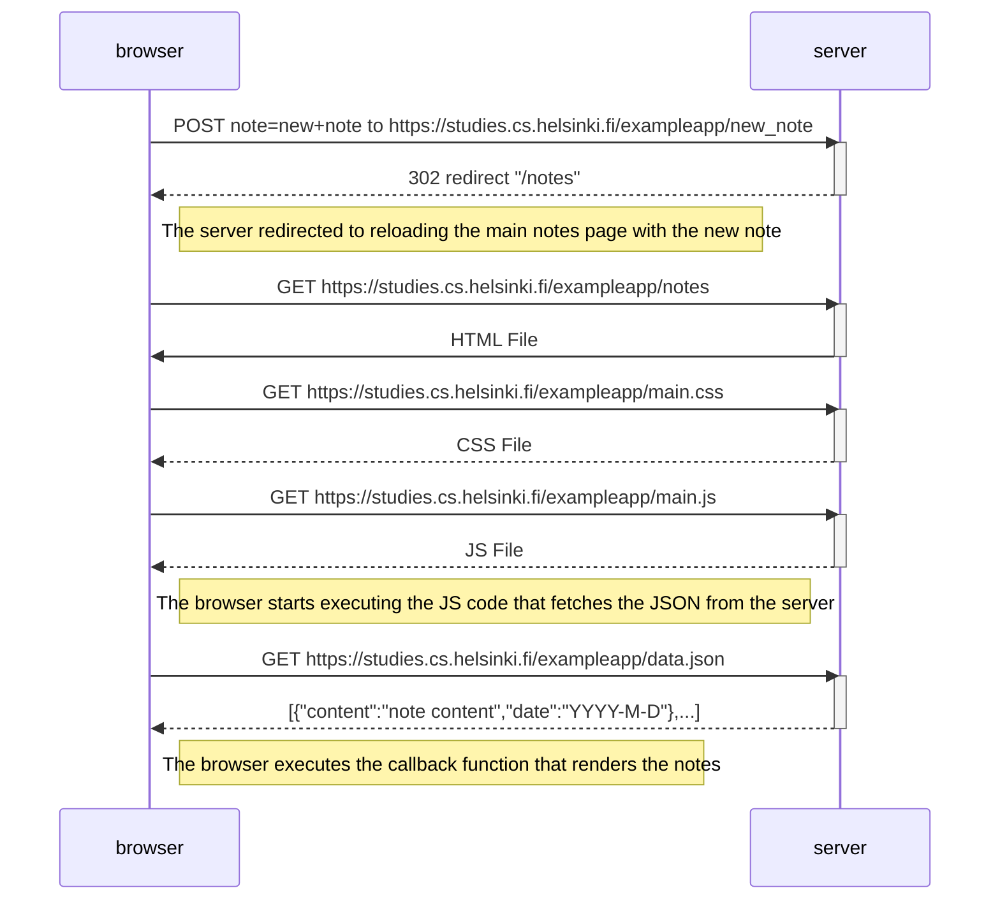

```mermaid
sequenceDiagram
  participant browser
  participant server

  browser->>server: POST note=new+note to https://studies.cs.helsinki.fi/exampleapp/new_note
  activate server
  server-->>browser: 302 redirect "/notes"
  deactivate server

  note right of browser: The server redirected to reloading the main notes page with the new note

  browser->>server: GET https://studies.cs.helsinki.fi/exampleapp/notes
  activate server
  server->>browser: HTML File
  deactivate server

  browser->>server: GET https://studies.cs.helsinki.fi/exampleapp/main.css
  activate server
  server-->>browser: CSS File
  deactivate server

  browser->>server: GET https://studies.cs.helsinki.fi/exampleapp/main.js
  activate server
  server-->>browser: JS File
  deactivate server

  note right of browser: The browser starts executing the JS code that fetches the JSON from the server
  
  browser->>server: GET https://studies.cs.helsinki.fi/exampleapp/data.json
  activate server
  server-->>browser: [{"content":"note content","date":"YYYY-M-D"},...]
  deactivate server

  note right of browser: The browser executes the callback function that renders the notes
```
