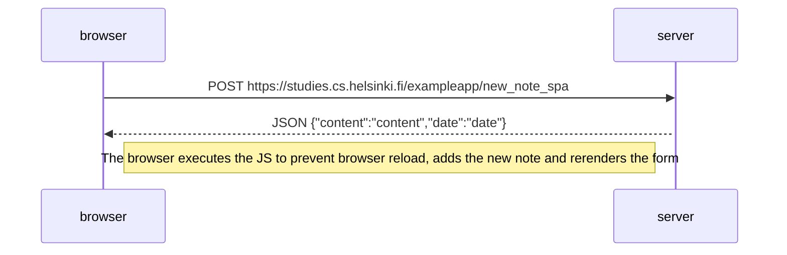

```mermaid
sequenceDiagram
    participant browser
    participant server

    browser->>server: POST https://studies.cs.helsinki.fi/exampleapp/new_note_spa
    activate server
    server-->>browser: JSON {"content":"content","date":"date"}


    Note right of browser: The browser executes the JS to prevent browser reload, adds the new note and rerenders the form

```
